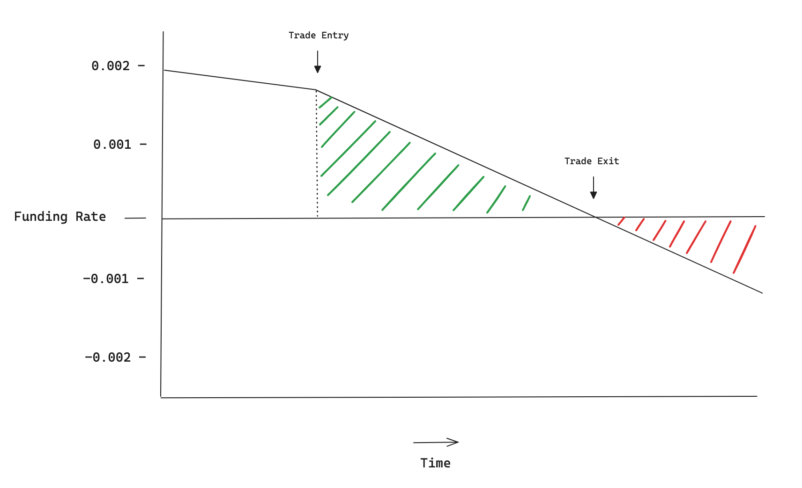

# Synthetix Funding Rate Arbitrage

> **Version 0.2.0**

 

This project serves as a template to help newer developers/traders start taking advantage of delta-neutral arbitrage opportunities between CEX/DEX perps platforms. Current version focuses on Synthetix vs Binance pairs, opening funding-accruing positions on Synthetix and hedging on Binance. 

Given that the repo is under active development, it is recommended that you run the bot on testnet for a while first to ensure that the configuration is correct before putting any capital at stake.

(No fees will be charged for running this bot, but if you happen to be inclined to charity the address is 0x7D8127Da2E23c5b371Ee436303BDCCe1c252afb1)

> *All code contained within this repository is distrubuted freely under the MIT License*

## Contributions
This repo is designed to be open source and as such we welcome any who may be interested in contributing to the codebase. To reach out, join the Telegram chat linked at the bottom of the README.

## Getting Started

To start, first clone the repo using `git clone git@github.com:50shadesofgwei/SynthetixFundingRateArbitrage.git`.

Next you'll want to navigate to the project directory using `cd SynthetixFundingRateArbitrage`, and then create a virtual environment with `python3 -m venv venv && source venv/bin/activate`. 
Install project dependencies with `pip install -r requirements.txt`.
To make sure you can run the project's commands directly from your terminal, run `pip install -e`.

After this, navigate to the .env file and input the necessary values. You will need:

- An Alchemy API key
- The relevant chainId (Base Mainnet: 8453, Base Testnet: 84532)
- Your wallet address and Private Key (For security reasons you should create a new wallet to use here)
- A Binance API key + secret
- A Coingecko API key

Recommended values for the following vars are as follows:
- `TRADE_LEVERAGE=5`
- `DELTA_BOUND=0.03`
- `PERCENTAGE_CAPITAL_PER_TRADE=25`

Trade Leverage specifies the leverage applied to the collateral amount on each trade. Setting this value too high will result in positions being liquidated, so keeping a relatively small cap is a good idea.
Delta Bound calculates the maximum delta on a trade pair before it will be cancelled by the health checker. The delta between positions will in most cases be 0.0, so this is mostly a failsafe.
Percentage Capital Per Trade specifies the amount of available capital to be used on each trade that is executed. This is derived by checking how much available collateral there is on each exchange, then taking the smaller value and calculating `(smallerValue/100)*PERCANTAGE_CAPITAL_PER_TRADE`. Higher values for this will of course make the trade sizes larger, and therefore will mean having to rebalance the collateral between exchanges more frequently.

In addition, you can choose which tokens to target/exclude from the searching algorithm via navigating to `APICaller.master.MasterUtils.py`, where you will find an array that looks like this:
```python
TARGET_TOKENS = [
    {"token": "BTC", "is_target": True},
    {"token": "ETH", "is_target": True},
]
```
To include/exclude a token, simply replace `True` with `False` and vice versa. The above example targets both BTC and ETH, but if for the sake of argument we only wanted to target ETH, we'd edit the array to look like the following:
```python
TARGET_TOKENS = [
    {"token": "BTC", "is_target": False},
    {"token": "ETH", "is_target": True},
]
```
The bot will now only target ETH opportunities.

Note that some additional steps are required before executing trades, namely that a Synthetix perps account will have to be created and have some collateral deployed. The code for this is found in the next section.

## Testnet config
To start executing some test trades, first you will need to mint some fUSDC on Base sepolia (you can do that [here](https://sepolia.basescan.org/address/0xa1ae612e07511a947783c629295678c07748bc7a#writeContract) by calling `deposit_eth` with some testnet Eth and '0x69980C3296416820623b3e3b30703A74e2320bC8' as the token_address argument). 
After you have some fUSDC, you can call the collateral deposit function by running the `deploy-collateral` command in the CLI. Once you click enter it will ask you for two variables, firstly the token address (which for fUSDC is 0x69980C3296416820623b3e3b30703A74e2320bC8), and the amount to deposit. Amount is denominated in USD terms, so to deposit 250.67 fUSDC, you'd enter the command as follows:
`
deploy-collateral 0x69980C3296416820623b3e3b30703A74e2320bC8 250.67
`

For the Binance side, you will have to create an account and set of API keys [here](https://testnet.binancefuture.com/en/futures/BTCUSDT), and use these keys in the .env file. Additionally, whether the Binance client is set to testnet or live trading is determined upon initialisation of the Binance clients. By default they will target testnet and look like so:

```python
self.client = Client(api_key, api_secret, base_url="https://testnet.binancefuture.com")
```

To switch to live trading, simply remove the final argument like so:

```python
self.client = Client(api_key, api_secret)
```

> As of version 0.2.0, there are Binance clients initialised in the following files. Make sure all are configured uniformly.
    - BinanceCaller.py
    - BinancePositionController.py
    - BinancePositionMonitor.py

## Console Scripts
The bot can be controlled via the CLI using the following commands:
- `deploy-collateral [token_address] [amount]`
- `project-run` (Run this command to start the bot after setup is finished)
- `close-all-positions`

## Video Walkthrough
A high level walkthrough can be found via following this link:
[Watch here](https://drive.google.com/file/d/1QlGKDZIhfQkfegQOnAi7ycPEOlvWn4ye/view?usp=sharing)

## Profitability Estimations
As of version 0.2.0, the impact of a potential trade on funding velocity is now taken into consideration when assessing the profitability of a position - maker/taker fees are also taken into account, and 8 new markets have been added to the searcher algorithm (by default, all will be selected). More markets will be added in future releases as they amass sufficient liquidity.

To estimate the profit for a trade we start with the Synthetix half - the trade details are generated by the MatchingEngine module and passed to CheckProfitability.py, where the user's `BASE_TRADE_SIZE_USD` is multiplied by their `TRADE_LEVERAGE` to find the total dollar value of the position. The market price of the asset is then called, and the dollar value converted into the amount of the asset in question which is halved, giving us the trade size per trade leg and finally we adjust for the side (long or short) of each trade and factor in the expected price impact. 
Now that we have the size of the position we are going to place on Synthetix, the next step is to calculate the effect that our trade will have on the funding velocity of the respective market. To do this, we use the `skew` value in our `opportunity` object along with the our trade size, and pass these as arguments to a helper function that will return the funding velocity after our trade is placed:
```python
@staticmethod
    def calculate_new_funding_velocity(symbol: str, current_skew: float, trade_size: float) -> float:
        try:
            market_data = MarketDirectory.get_market_params(symbol)
            c = market_data['max_funding_velocity'] / market_data['skew_scale']
            new_skew = current_skew + trade_size
            new_funding_velocity = c * new_skew
            return new_funding_velocity
        except Exception as e:
            raise ValueError(f"GlobalUtils - Failed to calculate new funding velocity for {symbol}: {e}")
```
Funding velocity is defined as the product of the formula `dr/dt = c * skew`, where `dr/dt` is the velocity, `c` is the constant factor `(maxFundingVelocity / skewScale)`, and `skew` is the measure of the imbalance between long and short open interest in the given market, measured in units of said asset. 

> (If this is a bit abstract, there's a good blog post that you can find [here](https://blog.synthetix.io/synthetix-perps-dynamic-funding-rates/) with some more intuitive explanations)

So to calculate the new funding velocity we solve for the above function by grabbing the market details from the `MarketDirectory` enum, which will be of type:
```python
ETH = {
        'market_id': 100,
        'symbol': 'ETH',
        'max_funding_velocity': 9,
        'skew_scale': 350000,
        'maker_fee': 0.000001,
        'taker_fee': 0.0005
    }
```
from which we calculate our constant factor and our new funding velocity.

Now that we have our funding velocity, we have to do some further calculations to give us an estimate of how long it will take before the funding rate turns against our trade. Fundamentally, the velocity figure shows us where the funding rate will be in 24 hours' time assuming no other trades are placed within that period. To visualise this, we can track the funding rate over time on a chart like so:



## Architecture

The project is designed according to a modular, event-driven architecture where functionality is grouped together into like kind sub-classes, instances of which are then contained in a master class which itself is contained within the main class. To illustrate, let's look at the APICaller module contains all logic for calling funding rate data from the relevant APIs. This module contains two sub-classes `SynthetixCaller` and `BinanceCaller`, where all the logic for interacting with the respective APIs is stored in the corresponding sub-class. Then an instance of each class is stored within the `MasterCaller` class, which contains all functions that require access to both of these APIs, an example being reading and identifying funding rate discrepancies between the two.
This inheritance structure is repeated with the Master modules, an instance of each being created in the Main class. The Main class therefore contains instances of the following:
    - `MasterCaller`
    - `MatchingEngine`
    - `MasterPositionMonitor`
    - `MasterPositionController`
    - `TradeLogger`

Cross-module communication is handled via event emitters and listeners, a directory of which can be found in GlobalUtils.py.
Upon confirmation of execution, trades are logged to a database with each side (SNX/Binance) having its own entry, and are linked via a shared UUID. Upon closing, the entries are updated with relevant PnL, accrued funding and reason for close. 

## Open Issues / Potential Improvements
> **Version 0.2.0**

**Shutdown** 

If you're running an instance of the bot and shut it down mid-trade, the positions won't close automatically; you'll have to close them manually either via the respective UIs or by using the CLI command:
`close-all-positions`

**Slippage**

In its current form, the bot uses market orders for both sides of each trade. For Synthetix this is mandated by the smart contracts but for the Binance side, there is a possibility that one could tighten the profit margins on each trade by using limit orders instead of market orders. The slippage is especially pronounced on Binance testnet because there's such little liquidity and therefore the bid/ask spread is very large, which also makes backtesting and + test PnL calculations harder to run off of testnet data.

**Moving Collateral <> Exchanges**

In current implementation, anyone running the bot over longer periods of time (or using really high leverage) will have to manually rebalance collateral across exchanges after a couple of trades due to the PnL imbalancing collateral amounts. If one wanted to maximise size on every trade, they would do this often.

## Tech Support 
Any further questions please join the telegram chat at https://t.me/+ualID7ueKuJjMWJk
