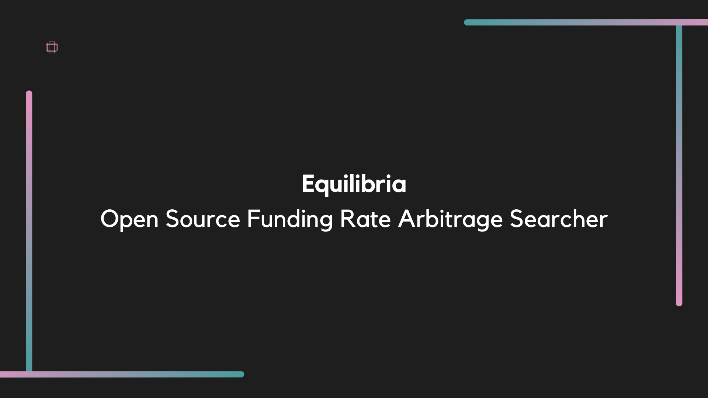

# Synthetix Funding Rate Arbitrage
  
**Version 0.3.0**  
 

A delta-neutral funding rate arbitrage bot targeting DEX-DEX pairs (e.g., GMX on Arbitrum, Synthetix v3 on Base).

## Quick Start
1. Clone: `git clone https://github.com/50shadesofgwei/funding-rate-arbitrage.git`
2. Install: `pip install -r requirements.txt && pip install -e .`
3. Configure: Copy `.env.example` to `.env` and fill in your keys.
4. Run: `project-run-demo`

> This repository is under active development and has not yet been ran extensively in production. By cloning or forking the code and running it locally, you understand that you are running in-development code, and take on all responsibility for any loss of funds that are incurred via user error, as-of-yet-undiscovered bugs, or any other concievable reason. You should be comfortable running, interacting with and debugging the bot on testnet before considering any runs with real capital. This project is for educational purposes only. Any interested party should not construe any information or other material found in this repository as legal, tax, investment, financial, or other advice. Nothing contained here constitutes a solicitation, recommendation, endorsement, or offer by the repository creator, the Synthetix Protocol, or any third party service provider to buy or sell any securities or other financial instruments in the US, nor in any other jurisdiction in which such solicitation or offer would be unlawful under the securities laws of said jurisdiction. Under no circumstances will the repository creator or the Synthetix or GMX Protocols be held responsible or liable in any way for any claims, damages, losses, expenses, costs, or liabilities whatsoever, including, without limitation, any direct or indirect damages for loss of profits.

## Documentation
See [docs/index.md](docs/index.md) for detailed guides on installation, usage, and contributing.

## Contributions
Join our [Telegram](https://t.me/+ualID7ueKuJjMWJk) to collaborate!

## License
MIT - See [LICENSE](LICENSE) for details.
